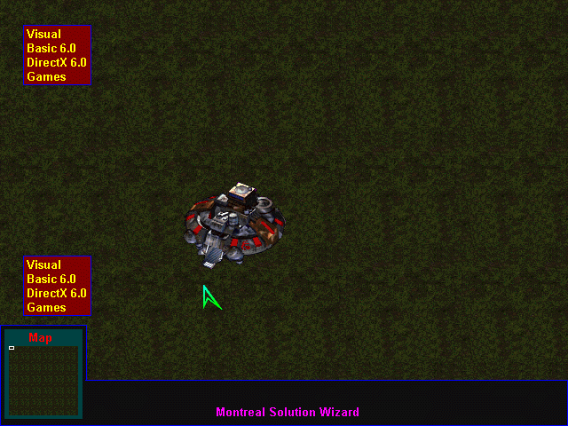



## D 2D Map Engine \(best one\)

### Description

This kind of code has never been posted before it

is a 2D Map engine same as StarCraft !!!! maybe better! ENJOY IT !! im the owner of this engine.

NEED DIRECTX 7 ( tested with vb 6 )

verry powerfull make Map big as the world and keep it powerfull REAL TIME ENGINE !!!

Please visit my new web site and see what you can do VB power !!!come and chat with me http://www.virtualgamer.t2u.com
 
### More Info
 
NEED DIRECTX 7 ( tested with vb 6 )

             |
---                |---
**Submitted On**   |2000-03-06 09:12:48
**By**             |[HarveySolutions](https://github.com/Planet-Source-Code/PSCIndex/blob/master/ByAuthor/harveysolutions.md)
**Level**          |Advanced
**User Rating**    |4.7 (93 globes from 20 users)
**Compatibility**  |VB 5\.0, VB 6\.0
**Category**       |[DirectX](https://github.com/Planet-Source-Code/PSCIndex/blob/master/ByCategory/directx__1-44.md)
**World**          |[Visual Basic](https://github.com/Planet-Source-Code/PSCIndex/blob/master/ByWorld/visual-basic.md)
**Archive File**   |[CODE\_UPLOAD3832362000\.zip](https://github.com/Planet-Source-Code/harveysolutions-d-2d-map-engine-best-one__1-6455/archive/master.zip)

### API Declarations

NEED DIRECTX 7 ( tested with vb 6 )

